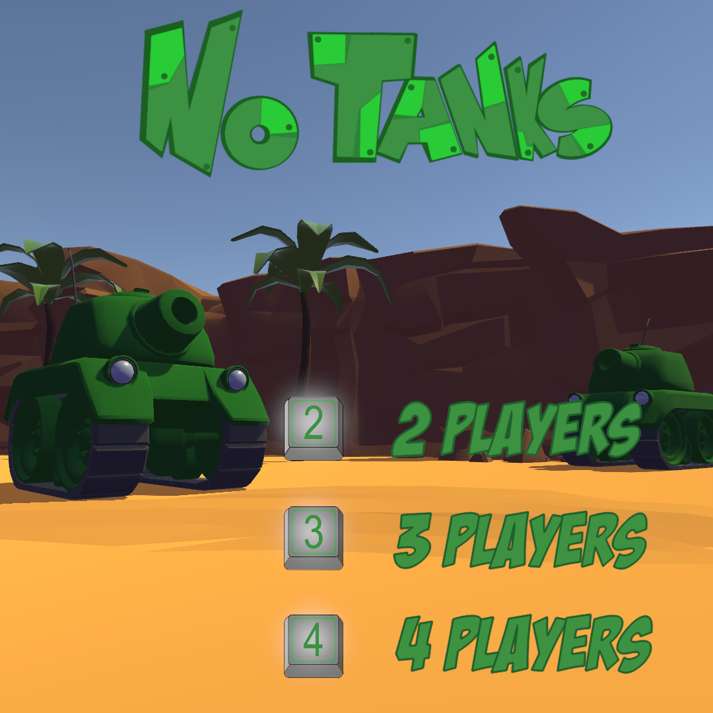
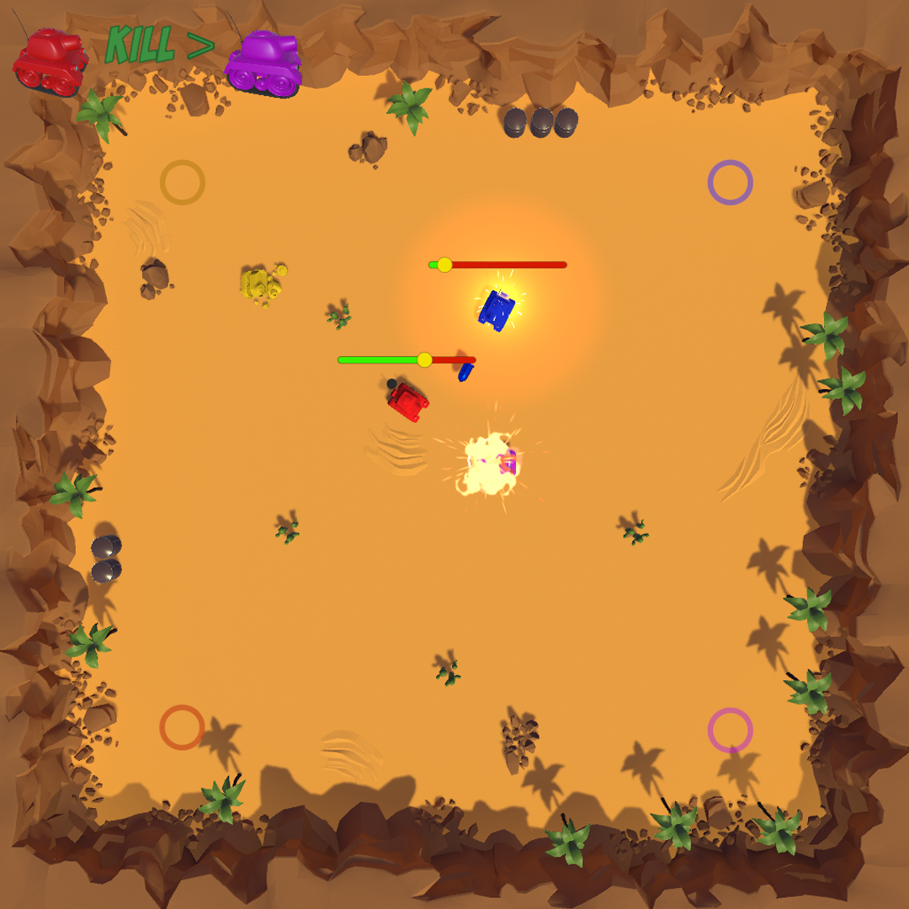
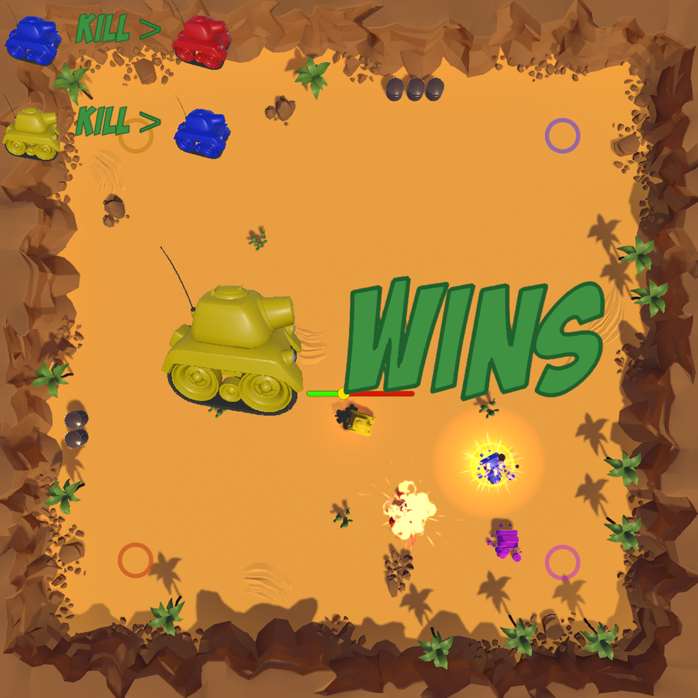

# NoTanks
A little **multiplayer** game (2 to 4 players)  about tanks fighting in a **top-view** arena. Your objective is simple : destroy your opponents' tanks before your own gets exploded ! 
This project was entirely developed by me in **Unity** with **C#** as a personal project during my second year of study.

## How to Install
- **Download the build**  
If you just want to have fun and test the game, the build is on my itchio page.  
<a href="https://viggoherault.itch.io/notanks/">viggoherault.itch.io/notanks</a>  
- **Clone the repository**  
You can install the project on your PC and open it in Unity to view the code and run the game.  
<a href="https://github.com/ViggoHerault/NoTanks/">github.com/ViggoHerault/NoTanks</a>  

## Screenshots

